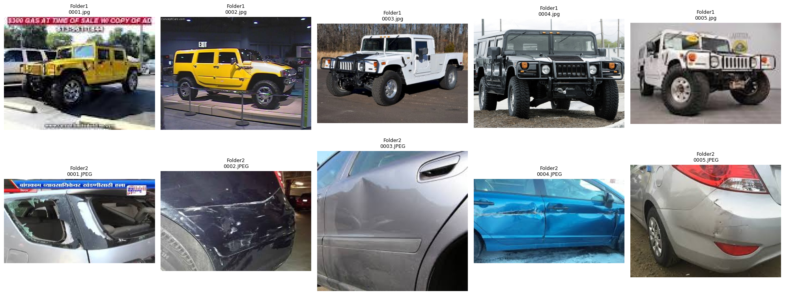
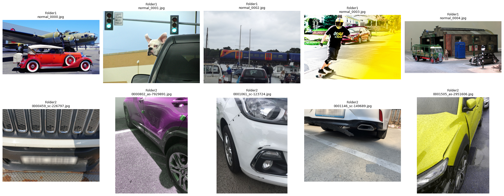

# **1주차 정리**

## 1.YOLO
- Pretrained YOLO 모델(yolov8n)로 데이터셋의 background 와 normal/damaged 폴더를 차량아님/차량 으로 구분하는 테스트 수행시 Accuracy Score 0.7169 확인
- YOLO의 pretrained 모델은 차량의 전체 이미지를 학습한 것에 반해 우리의 데이터셋중 파손DATA는 차량의 일부만 촬영된 부분이 많기 때문

## 2.Resnet18
- Pretrained 모델을 호출하여 주어진 데이터셋으로 차량여부를 판단하는 Stage1 모델과 차량파손여부를 판단하는 Stage2 모델을 개발
- Stage1: Accuracy 0.97, f1 0.96
- Stage2: Accuracy 0.99, f1 0.96

※ 각 단계별 모델학습 epoch 설정을 20으로 했을때보다 5로 설정하였을때 모델 성능이 일부 더 좋았으나 아래에서 Resnet18 모델은 epoch 설정을 20으로 한 모델을 활용하였음

# **2주차: 차량파손여부**

## 1.1주차때 학습했던 Resnet18 모델의 성능 추가 검증

- 1주차에서 주어진 데이터셋으로 개발된 모델(Resnet18)의 성능을 좀 더 구체적으로 확인하기 위해 Kaggle에서 구한 데이터셋(정상차량, 파손차량)을 활용하여 테스트
- 정상차량 920개 중 612개를 정상차량으로 판단(308개는 파손으로 잘못 탐지) -> Accuracy: 0.6652(612/920)
- 파손차량 920개 중 524개를 파손차량으로 판단(396개는 정상으로 잘못 탐지) -> Accuracy: 0.5696(524/920)

※ 모델 경로\
/(share)HDMF_AUTO_SPOKE/SUBJECT/WEEK1_CAR_DETECTION/JR/01.Model/damage_classifier_stage2(20epoch).pth

※ 코드 경로\
/(share)HDMF_AUTO_SPOKE/SUBJECT/WEEK2_CAR_DAMAGE_DETECTION/JR/02.Code/(25.12.19)_Damaged_Detection_Test(by resnet18).ipynb

### **[참고] 테스트에 활용한 Kaggle Datasets**(Car damage detection)

출처: https://www.kaggle.com/datasets/anujms/car-damage-detection

[kaggle dataset과 현재 study 데이터셋)\
1.kaggle dataset\

2.study dataset\

## 2.Kaggle Dataset으로 모델 학습
- Kaggle의 (Car damage detection) Dataset으로 차량파손여부를 분류하는 모델을 학습해 보았음(Resnet18 Pretrained model 활용)
- Dataset 구조(Train: 정상 920, 파손: 920, Val: 정상 320, 파손 320)
- 모델 성능은 동일한 Datasets의 val Data를 활용하였을때 정확도 0.9609로 매우 유효하였음

Confusion Matrix (rows=true, cols=pred):\
 [[222 /  8]\
 [ 10 / 220]]

 ※ 모델 경로(google drive)
 ./(share)HDMF_AUTO_SPOKE/SUBJECT/WEEK2_CAR_DAMAGE_DETECTION/JR/01.Model/resnet18_damage_vs_whole_best.pth

 ※ 코드
 ./(share)HDMF_AUTO_SPOKE/SUBJECT/WEEK2_CAR_DAMAGE_DETECTION/JR/02.Code/(25.12.19) Damaged_Detection_Modeling(with different datasets).ipynb

 ### 2-1. Kaggle Dataset으로 만든 모델을 Study Dataset으로 재검증
- 하지만 이 모델을 다시 Study Dataset으로 검증해 보기 위해 Study Data의 Damaged를 Damaged로 잘 분류하는지 확인해 보았으나 정확도는 0.3958로 매우 낮게 나타남
- Total images           : 1200
- Pred DAMAGED (correct) : 475
- Pred NORMAL (wrong/FN) : 725
- Accuracy               : 0.3958 (475/1200)

 ※ 코드 경로
 (share)HDMF_AUTO_SPOKE/SUBJECT/WEEK2_CAR_DAMAGE_DETECTION/JR/02.Code/(25.12.19)_Damaged_Detection_Test(by resnet18_2nd).ipynb

  # [추가 검토]

  ## 현재 우리의 Study Dataset과 kaggle dataset(train data만)을 합쳐서 학습 및 평가 수행해보았음

- dataset 구성방법: yolo pretrained 모델을 활용하여 모델이 차량을 인식한 사진 중 차량이 전체 사진의 50% 이상인 사진만을 dataset으로 활용
- normal: 1077개 중 543개 사용
- damaged: 2120개 중 1051개 사용

- ※ 코드 경로: (share)HDMF_AUTO_SPOKE/SUBJECT/WEEK2_CAR_DAMAGE_DETECTION/JR/02.Code/(25.12.24) Damaged_Detection_Modeling(with different datasets)_v2.ipynb

- 
[YOLO-CLS] Test metrics

- Accuracy : 0.9378
- F1 (pos=damaged) : 0.9524   
- (Precision 0.9615, Recall 0.9434)

※ 모델경로(가중치): (share)HDMF_AUTO_SPOKE/SUBJECT/WEEK2_CAR_DAMAGE_DETECTION/JR/01.Model/(25.12.24)_yolo_best_weight.pt

[ResNet18] Test metrics

- Accuracy : 0.9170
- F1 (pos=damaged) : 0.9351   
- (Precision 0.9664, Recall 0.9057)

※ 모델경로: /(share)HDMF_AUTO_SPOKE/SUBJECT/WEEK2_CAR_DAMAGE_DETECTION/JR/01.Model/(25.12.24)_yolo_best_weight.pt

## 하지만 이렇게 개발한 모델을 다시 kaggle dataset의 test(학습에 사용하지 않음) data로 검증해 보았더니 아래와 같이 확인

※ 모델학습은 yolo 가 차량으로 인식한 사진만 활용한 반면 이번 test data는 이런 방식으로 이미지를 필터링하지 않았기 때문?

[ResNet18 (best.pt)]\
Accuracy: 0.7913\
F1 (pos=damage): 0.8202

[YOLO (best_weight.pt)]\
Accuracy: 0.5696\
F1 (pos=damage): 0.6963

※ 코드경로: (share)HDMF_AUTO_SPOKE/SUBJECT/WEEK2_CAR_DAMAGE_DETECTION/JR/02.Code/(25.12.24) Damaged_Detection_Modeling(with different datasets)_v2_test_w_kaggle_testdata.ipynb
